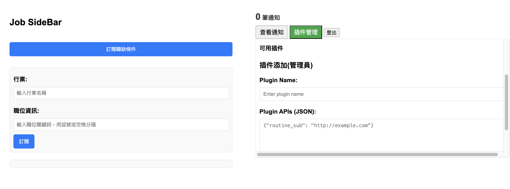

# Notification System

基於 [TabColab](https://github.com/YiHsinTseng/tabcolab-api) 延伸設計之通知系統，藉由外掛功能的添加，用於擴展SideBar以及卡片可涵蓋資訊的可能性。

## 前置作業

需要搭配Job_Sub_Pub的伺服器開啟使用

https://github.com/YiHsinTseng/JobSubPub

啟動後會立刻執行爬蟲（其後是每天9:00定時爬蟲）

## 本地安裝並啟動MongoDB

```
brew tap mongodb/brew
brew install mongodb-community@5.0
brew services start mongodb/brew/mongodb-community
```

## 測試環境變數

```
WHITE_LIST=

PORT=5050
MONGODB_URI_LOCAL=mongodb://localhost:27017/yourDatabaseName
MONGODB_URI_CLOUD=

SERVICE_HOST=localhost
SERVICE_PORT=4000
PASSPORT_SECRET=YOURSECRET
MQTT_BROKER_PORT=1884 #搭配Job_Sub_Pub 本地測試
CRON_SCHEDULE='0 4 * * *'
```

## 啟動應用

```
node server.js
```

## 登入帳密(管理員)
```
帳號： admin123@gmail.com
密碼： admin123
```

## 初始化設定



### 添加插件(管理員)

Plugin Name:
```
Job_Sub_Pub
```
Plugin APIs (JSON):
```
{
    "getSubConditions": {
        "description": "取得定時訂閱條件",
        "url": "http://localhost:4000/api/conditions_subscriptions/:user_id",
        "method": "GET",
        "replace":{
            "path_params":	{
                "user_id":"public_id"
            }
        } 
    },
    "subConditions": {
        "description": "定時訂閱條件",
        "url": "http://localhost:4000/api/conditions_subscriptions/:user_id",
        "method": "POST",
        "replace":{
            "path_params":	{
                "user_id":"public_id"
            }
        } 
    },
    "getPubbedJobs": {
        "description": "取得定時推播後詳細職缺內容",
        "url": "http://localhost:4000/api/jobs/published",
        "method": "GET",
        "replace":{
            "body":	{
                "user_id":"public_id"
            }
        }
    },
    "getSubEntities": {
            "description": "取得即時訂閱對象",
        "url": "http://localhost:4000/api/entities_subscriptions/:user_id",
        "method": "GET",
        "replace":{
            "path_params":{
                "user_id":"public_id"
            }
        }
    },
    "subbedCompany": {
        "description": "訂閱或取消訂閱公司",
        "url": "http://localhost:4000/api/entities_subscriptions/company/:company_name",
        "method": ["POST","DELETE"],
        "replace":{
            "path_params":{
                "company_name":"body.company_name"
            },
            "body":	{
                "user_id":"public_id"
            }
        }
    },
    "subbedJob": {
        "description": "訂閱或取消訂閱職位",
        "url": "http://localhost:4000/api/entities_subscriptions/job/:job_id",
        "method": ["POST","DELETE"],
        "replace":{
            "path_params":{
                "job_id":"body.job_id"
            },
            "body":	{
                "user_id":"public_id"
            }

        }
    }
}
```

Plugin UI (JSON):
```
{
  "sidebar": {
      "openJobs": {
      "byNotifField": {
          "sender": "Job_Pub",
          "type": "routine"
      },
      "action": "openJobs"
      },
      "openJobsInfo": {
      "byNotifField": {
          "sender": "Job_Pub",
          "type": ["job_id_channel", "company_name_channel"]
      },
      "action": "openJobsInfo"
      }
  }
}
```

### 輸入訂閱條件範例（定時條件推播）

行業:
```
消費性電子產品製造業, 電腦軟體服務業
```
職位資訊:
```
Node.js MySQL
```


## 測試功能

### 以API立刻觸發推播

利用postman發送 POST api： http://localhost:4010/api/trigger-push

用於立即根據訂閱條件取得推送通知

點擊通知顯示職缺詳情，並可根據有興趣的職缺或公司個別訂閱，如有更新內容或是新增職缺會個別立即推送

### 以API立刻觸發爬蟲並測試即時職缺或公司推播

利用postman發送 POST api：http://localhost:5060/go_job

如有職缺有變動或公司有任何新職缺會獨立以單條通知推送